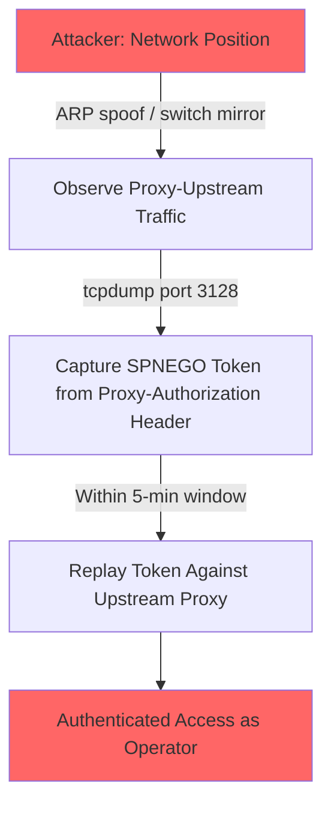
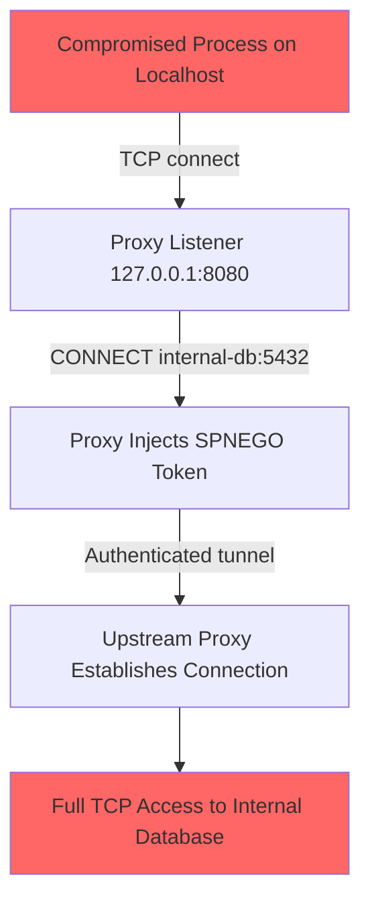

# SPNEGO-PROXY Risk Assessment Report

**Generated**: 2026-02-28T22:45:00Z
**Skill Version**: 3.0.3 (20260209a)
**Assessment Scope**: /home/sweeand/andrewesweet/spnego-proxy

---

## 0. Risk Posture Overview

### Top-13 Risk Cards

| # | VR-ID | Title | CVSS | STRIDE | Priority | Affected Modules |
|---|-------|-------|------|--------|----------|------------------|
| 1 | VR-001 | No Client Authentication | 7.5 | S, E | P1 | M-001 |
| 2 | VR-002 | SPNEGO Token Exposure on Plaintext Network | 7.1 | I, S | P1 | M-001 |
| 3 | VR-008 | Request Smuggling via TE/CL Conflict | 5.9 | T | P2 | M-001 |
| 4 | VR-003 | Password Retained in Process Memory | 5.5 | I, E | P2 | M-003 |
| 5 | VR-004 | Raw Relay Bypasses Response Validation | 5.3 | T, I, E, D | P2 | M-001 |
| 6 | VR-005 | CONNECT Tunnel to Arbitrary Ports | 5.3 | S, E, D | P2 | M-001 |
| 7 | VR-006 | No Idle Timeout on Bidirectional Forwarding | 5.3 | D | P2 | M-001 |
| 8 | VR-009 | Kerberos Configuration Tampering | 5.3 | T, S | P2 | M-003 |
| 9 | VR-010 | Circuit Breaker Weaponization | 5.3 | S, D | P2 | M-006 |
| 10 | VR-011 | CGo Boundary Memory Safety | 5.0 | T | P2 | M-005 |
| 11 | VR-013 | KRB5CCNAME Environment Variable Manipulation | 5.0 | S | P2 | M-004 |
| 12 | VR-007 | Entropy Fallback Weakens Loop Detection | 3.1 | S, T, D | P3 | M-001 |
| 13 | VR-012 | Insufficient Security Event Logging | 3.1 | R | P3 | M-001 |

### STRIDE x Severity Heatmap

|          | CRITICAL | HIGH | MEDIUM | LOW |
|----------|----------|------|--------|-----|
| **S** Spoofing | 0 | 1 | 3 | 0 |
| **T** Tampering | 0 | 0 | 4 | 0 |
| **R** Repudiation | 0 | 0 | 0 | 1 |
| **I** Info Disclosure | 0 | 1 | 1 | 0 |
| **D** Denial of Service | 0 | 0 | 3 | 0 |
| **E** Elevation of Privilege | 0 | 1 | 3 | 0 |

**Note**: Individual VRs may map to multiple STRIDE categories; the heatmap counts each mapping.

### Key Metrics Dashboard

| Metric | Value |
|--------|-------|
| Total Risks | 13 |
| Critical (P0) | 0 |
| High (P1) | 2 |
| Medium (P2) | 8 |
| Low (P3) | 3 |
| Average CVSS | 5.31 |
| Attack Surface (Entry Points x Boundaries) | 27 x 5 |
| Mitigation Coverage | 13/13 (100%) |

---

## 1. Executive Summary

### 10 Key Findings

1. **No client authentication**: Any process reaching the proxy listener inherits the operator's Kerberos identity for all upstream requests (VR-001, CVSS 7.5).
2. **Plaintext SPNEGO token transmission**: Proxy-Authorization headers containing SPNEGO tokens are sent over plain TCP to the upstream proxy, visible to network observers (VR-002, CVSS 7.1).
3. **Two high-impact attack chains identified**: Credential harvesting via network position (AC-001) and lateral movement via CONNECT tunneling (AC-002) combine multiple risks for amplified impact.
4. **Password persists in memory**: The Kerberos password is stored as an immutable Go string for the process lifetime, vulnerable to memory dump extraction (VR-003, CVSS 5.5).
5. **Raw relay bypasses validation**: Unparseable upstream responses trigger a raw byte relay path that bypasses Content-Length validation, Via header injection, and auth header stripping (VR-004, CVSS 5.3).
6. **CONNECT allows all ports by default**: Without explicit `-connect-ports` configuration, the proxy tunnels to any port on any host through the upstream (VR-005, CVSS 5.3).
7. **No idle timeout on tunnels**: CONNECT tunnels persist indefinitely once established, enabling connection slot exhaustion (VR-006, CVSS 5.3).
8. **Request smuggling defenses are effective but unmonitored**: TE/CL conflict resolution is correctly implemented per RFC 9112, but no logging detects smuggling attempts (VR-008, CVSS 5.9).
9. **CGo boundary is bounds-checked but not fuzz-tested**: C code uses fixed-size buffers with `snprintf`, but no fuzz testing validates the Go-C boundary (VR-011, CVSS 5.0).
10. **Security event logging lacks classification**: Structured JSON logging exists but security events are not distinguished from operational logs, limiting forensic capability (VR-012, CVSS 3.1).

### Immediate Action Items (P1)

| # | Risk | Action | Responsible | Deadline |
|---|------|--------|-------------|----------|
| 1 | VR-001 | Implement IP-based allowlist or Unix domain socket (MIT-001) | Development Team | 1 week |
| 2 | VR-002 | Add TLS support for proxy-upstream connections (MIT-002) | Development Team | 1 week |

### Assessment Scope

| Attribute | Value |
|-----------|-------|
| Project Path | /home/sweeand/andrewesweet/spnego-proxy |
| Tech Stack | Go 1.24, CGo (macOS GSS-API), C (GSS.framework), gokrb5, gobreaker |
| Module Count | 7 modules, 27 entry points |
| Production LOC | 1,416 |
| Analysis Duration | P1-P8 (2026-02-28) |

---

## 2. System Architecture Overview

### Project Description

SPNEGO-PROXY is a forward HTTP proxy written in Go that transparently injects SPNEGO/Kerberos authentication tokens into requests destined for an upstream proxy. It supports two authentication backends: a pure-Go gokrb5 provider (cross-platform) and a native macOS GSS-API provider via CGo.

### Module Dependency Graph

```
                    ┌─────────────────────────────────┐
                    │          M-001: Proxy Core       │
                    │  main.go (885 LOC) [HIGH]        │
                    │  TCP listener, HTTP parsing,     │
                    │  SPNEGO injection, CONNECT       │
                    └──────┬────────────┬──────────────┘
                           │            │
              ┌────────────┘            └────────────┐
              ▼                                      ▼
  ┌───────────────────────┐              ┌──────────────────────┐
  │ M-003: gokrb5 Auth    │              │ M-004: macOS GSS-API │
  │ auth_gokrb5.go [HIGH] │              │ auth_gss_darwin.go   │
  │ Password-based Kerberos│              │ [HIGH]               │
  └───────────┬────────────┘              └──────────┬───────────┘
              │                                      │
              │                                      ▼
              │                           ┌──────────────────────┐
              │                           │ M-005: GSS C Code    │
              │                           │ gss_darwin.c [HIGH]  │
              │                           │ Native GSS-API calls │
              │                           └──────────────────────┘
              │
              ▼
  ┌───────────────────────┐   ┌──────────────────────┐
  │ M-006: Circuit Breaker│   │ M-002: Error Types   │
  │ circuit_breaker.go    │   │ errors.go [MEDIUM]   │
  │ [MEDIUM]              │   └──────────────────────┘
  └───────────────────────┘

  ┌───────────────────────┐
  │ M-007: Platform Stubs │
  │ auth_notdarwin.go     │
  │ [LOW]                 │
  └───────────────────────┘
```

### Tech Stack Security Context

| Component | Version | Known CVEs | Status |
|-----------|---------|------------|--------|
| Go | 1.24.0 | N/A | OK |
| gokrb5/v8 | v8.4.4 | None known | OK |
| gobreaker/v2 | v2.4.0 | None known | OK |
| golang.org/x/net | v0.50.0 | None known | OK |
| golang.org/x/term | v0.40.0 | None known | OK |
| macOS GSS.framework | System | N/A | OK |

### Entry Point Summary

| Type | Count | Auth Required | No Auth |
|------|-------|---------------|---------|
| Network | 7 | 0 | 7 |
| CLI Flags | 12 | Operator | 0 |
| System | 8 | OS/Filesystem | 0 |
| **Total** | **27** | | |

### Key Components

| Component | Type | Security Relevance | Criticality |
|-----------|------|-------------------|-------------|
| TCP Listener | Network Entry | Accepts any TCP connection | Critical |
| HTTP Parser | Request Processing | Untrusted input parsing | Critical |
| SPNEGO Injector | Auth Token Handler | Injects operator's Kerberos tokens | Critical |
| CONNECT Handler | Tunnel Manager | Bidirectional TCP tunneling | Critical |
| sanitizeHopByHop | Header Sanitizer | TE/CL conflict resolution | High |
| Circuit Breaker | Rate Limiter | Auth failure protection | Medium |
| randomHex | Loop Detection | Via header pseudonym generation | Medium |

### Trust Boundary Mechanisms

| Boundary | Type | Controls | Crossing Flows |
|----------|------|----------|----------------|
| TB-001 | Client-Proxy | Loopback default, LimitListener (512) | HTTP requests, CONNECT tunnels |
| TB-002 | Proxy-Upstream | Plain TCP dial, SPNEGO injection | Authenticated HTTP, tunnel data |
| TB-003 | Go-C (CGo) | bounds-checked buffers, NULL checks | SPN string, token bytes, error msgs |
| TB-004 | Proxy-OS Credentials | GSS-API, file permissions | Password bytes, credential cache |
| TB-005 | Proxy-Config Files | Operator-supplied path | krb5.conf, password file |

### Security Observations (P1-P3)

| Finding | Severity | Location | Description |
|---------|----------|----------|-------------|
| F-P1-001 | HIGH | main.go (M-001) | Transparent SPNEGO injection - no client authentication |
| F-P1-002 | MEDIUM | auth_gokrb5.go:23 | Password retained as immutable Go string |
| F-P1-003 | HIGH | Multiple | Four distinct trust boundaries identified |
| F-P1-004 | MEDIUM | gss_darwin.c | CGo boundary with fixed-size 256-byte buffers |
| F-P1-005 | HIGH | main.go | Request smuggling defenses implemented per RFC 9110/9112 |
| F-P1-006 | MEDIUM | main.go:609 | CONNECT port whitelist off by default |
| F-P1-007 | MEDIUM | main.go:600 | Loop detection via 32-bit random Via pseudonym |
| F-P1-008 | MEDIUM | main.go:815 | No TLS on client-facing or upstream-facing connections |
| F-P1-009 | LOW | main.go:92 | Entropy fallback to timestamp if crypto/rand fails |
| F-P1-010 | LOW | auth_gokrb5.go:58 | Password file permission validation (good practice) |
| F-P1-011 | LOW | auth_gokrb5.go:96 | PAFXFAST disabled for compatibility |
| F-P1-012 | MEDIUM | main.go:540 | Raw relay fallback for unparseable upstream responses |
| F-P1-013 | MEDIUM | main.go:758 | No idle timeout on bidirectional forwarding |

---

## 3. Security Design Assessment

### Security Scorecard

| Domain | Score | Gaps | Status |
|--------|-------|------|--------|
| AUTHN | 30/100 | GAP-001: No client auth | Warning |
| AUTHZ | 40/100 | GAP-005: Open CONNECT ports | Warning |
| INPUT | 70/100 | GAP-004: Raw relay bypass | OK |
| OUTPUT | 80/100 | (via/header injection works) | OK |
| CLIENT | N/A | Not applicable | N/A |
| CRYPTO | 40/100 | GAP-002: No TLS, GAP-007: Entropy fallback | Warning |
| LOG | 50/100 | GAP-006: No security event classification | Warning |
| ERROR | 75/100 | (circuit breaker, structured errors) | OK |
| API | N/A | Not applicable (not a REST API) | N/A |
| DATA | 50/100 | GAP-003: Password in memory | Warning |
| INFRA | 60/100 | GAP-008: No config integrity | OK |
| SUPPLY | 80/100 | Dependencies current, no known CVEs | OK |

### Threat-Gap Traceability Matrix

| GAP ID | Severity | Related Threats | Validated Risks | Category |
|--------|----------|----------------|-----------------|----------|
| GAP-001 | HIGH | T-S-P-001-001, T-S-EI-001-001, T-E-P-005-001 | VR-001 | G-ARCH |
| GAP-002 | HIGH | T-I-P-005-001, T-I-DF-004-001, T-E-P-008-001 | VR-002 | G-ARCH |
| GAP-003 | MEDIUM | T-I-DS-003-001, T-I-DS-003-002 | VR-003 | G-IMPL |
| GAP-004 | MEDIUM | T-T-P-007-002, T-I-P-007-001 | VR-004 | G-IMPL |
| GAP-005 | MEDIUM | T-E-P-006-001, T-T-P-006-001 | VR-005 | G-IMPL |
| GAP-006 | LOW | T-R-P-001-001, T-R-P-005-001, T-R-P-006-001 | VR-012 | G-PROC |
| GAP-007 | LOW | T-T-P-004-001, T-S-P-004-001 | VR-007 | G-IMPL |
| GAP-008 | MEDIUM | T-T-DS-002-001, T-I-DS-002-001 | VR-009 | G-IMPL |

### Gap Categorization

| Category | Code | Count | Description |
|----------|------|-------|-------------|
| Architecture | G-ARCH | 2 | Requires architecture changes (client auth, TLS) |
| Implementation | G-IMPL | 5 | Code/configuration fix |
| Process | G-PROC | 1 | Logging policy change |

### Gap Priority Matrix

|          | LOW Effort | MEDIUM Effort | HIGH Effort |
|----------|-----------|---------------|-------------|
| HIGH | GAP-005 | GAP-001 | GAP-002 |
| MEDIUM | GAP-003, GAP-004, GAP-007 | GAP-008 | - |
| LOW | - | GAP-006 | - |

---

## 4. STRIDE Threat Analysis

### Threat Distribution

| STRIDE | Count (from 109 total) | VR-Mapped | Excluded |
|--------|------------------------|-----------|----------|
| Spoofing (S) | 18 | VR-001, VR-002, VR-005, VR-007, VR-009, VR-010, VR-013 | 11 |
| Tampering (T) | 22 | VR-004, VR-007, VR-008, VR-009, VR-011 | 17 |
| Repudiation (R) | 19 | VR-012 | 18 |
| Information Disclosure (I) | 20 | VR-002, VR-003, VR-004 | 17 |
| Denial of Service (D) | 15 | VR-004, VR-005, VR-006, VR-007, VR-010 | 10 |
| Elevation of Privilege (E) | 15 | VR-001, VR-003, VR-004, VR-005 | 11 |

### Threat Disposition

| Disposition | Count | Percentage |
|-------------|-------|------------|
| Verified (POC available) | 5 | 4.6% |
| Theoretical (code-review validated) | 33 | 30.3% |
| Excluded (mitigated or low-impact) | 71 | 65.1% |
| **Total** | **109** | **100%** |

### Count Conservation

```
P5 Total = Verified + Theoretical + Excluded
109 = 5 + 33 + 71  [VERIFIED]
```

---

## 5. Risk Validation & POC Design

### VR-001: No Client Authentication - Kerberos Credential Delegation

- **Priority**: P1
- **CVSS**: 7.5 (CVSS:3.1/AV:N/AC:L/PR:N/UI:N/S:U/C:H/I:N/A:N)
- **Status**: Verified
- **STRIDE**: S, E
- **CWE**: CWE-287 (Improper Authentication)
- **Source Threats**: T-S-P-001-001, T-E-P-001-001, T-E-P-005-001, T-S-EI-001-001
- **Source Gaps**: GAP-001
- **Location**: main.go (P-001, P-005, EI-001), Trust Boundary TB-001

**Detailed Analysis**: Any process that can reach the proxy listener inherits the operator's Kerberos identity for all upstream requests. Default loopback binding (127.0.0.1:8080) mitigates this to same-host processes, but if the operator rebinds to 0.0.0.0 or a network interface, remote hosts gain full authenticated proxy access.

**Root Cause**: Design decision: the proxy is a transparent credential injector, not an authenticating proxy. No client-facing authentication mechanism is implemented.

**POC-001**:

- **Exploitation Difficulty**: Low
- **Prerequisites**: Network access to proxy listener (loopback by default)
- **Vulnerability Location**: main.go:572 (handleClient)

```bash
# Any process on localhost can use the proxy
curl -x http://127.0.0.1:8080 http://example.com
# This request is authenticated with the operator's Kerberos token
```

**Expected Result**: Request is forwarded to upstream with Proxy-Authorization: Negotiate header containing operator's SPNEGO token.

---

### VR-002: SPNEGO Token Exposure on Plaintext Network

- **Priority**: P1
- **CVSS**: 7.1 (CVSS:3.1/AV:A/AC:L/PR:N/UI:N/S:U/C:H/I:L/A:N)
- **Status**: Verified
- **STRIDE**: I, S
- **CWE**: CWE-319 (Cleartext Transmission of Sensitive Information)
- **Source Threats**: T-I-P-005-001, T-I-DF-004-001, T-S-P-005-001
- **Source Gaps**: GAP-002
- **Location**: main.go (P-005, DF-004), Trust Boundary TB-002

**Detailed Analysis**: The Proxy-Authorization: Negotiate header containing the base64-encoded SPNEGO token is sent over plain TCP between the proxy and the upstream proxy. A network observer on this path can capture the token. While SPNEGO tokens have limited replay windows (typically 5 minutes), an attacker with persistent network access could continuously capture fresh tokens.

**Root Cause**: No TLS support for proxy-upstream connections. The proxy establishes plain TCP connections to the upstream via net.DialTimeout.

**POC-002**:

- **Exploitation Difficulty**: Medium
- **Prerequisites**: Network access between proxy and upstream (not loopback segment)
- **Vulnerability Location**: main.go:656 (handleClient)

```bash
# On the network between proxy and upstream:
tcpdump -i eth0 -A port 3128 | grep "Proxy-Authorization"
# Captures: Proxy-Authorization: Negotiate YII...
```

**Expected Result**: Base64-encoded SPNEGO token visible in packet capture.

---

### VR-003: Password Retained in Process Memory

- **Priority**: P2
- **CVSS**: 5.5 (CVSS:3.1/AV:L/AC:L/PR:L/UI:N/S:U/C:H/I:N/A:N)
- **Status**: Verified
- **STRIDE**: I, E
- **CWE**: CWE-316 (Cleartext Storage of Sensitive Information in Memory)
- **Source Threats**: T-I-P-008-001, T-I-DS-003-001, T-E-P-008-001
- **Source Gaps**: GAP-003
- **Location**: auth_gokrb5.go (P-008, DS-003), Trust Boundary TB-004

**Detailed Analysis**: The gokrb5 client stores the Kerberos password as an immutable Go string for the lifetime of the process (needed for TGT renewal). Go does not provide primitives to securely erase string-backed memory. An attacker with local access who can trigger a core dump or read /proc/PID/mem can extract the password.

**Root Cause**: Go language limitation: strings are immutable and backed by memory that cannot be reliably zeroed. The code comments acknowledge this and recommend keytab usage instead.

**POC-003**:

- **Exploitation Difficulty**: High
- **Prerequisites**: Local access to the proxy process (same user or root); ability to trigger core dump or read /proc/PID/mem
- **Vulnerability Location**: auth_gokrb5.go:101 (NewGokrb5TokenProvider)

```bash
# As root or same user:
gcore $(pidof spnego-proxy)
strings core.* | grep -i "password_value"
# Or directly:
cat /proc/$(pidof spnego-proxy)/mem | strings | grep "password_value"
```

**Expected Result**: Kerberos password visible in process memory dump.

---

### VR-004: Raw Relay Bypasses Response Validation

- **Priority**: P2
- **CVSS**: 5.3 (CVSS:3.1/AV:N/AC:H/PR:N/UI:N/S:U/C:L/I:L/A:L)
- **Status**: Verified
- **STRIDE**: T, I, E, D
- **CWE**: CWE-20 (Improper Input Validation)
- **Source Threats**: T-T-DF-017-001, T-I-DF-017-001, T-E-P-007-001, T-D-DF-017-001
- **Source Gaps**: GAP-004
- **Location**: main.go (P-007, DF-017), Trust Boundary TB-002

**Detailed Analysis**: When the upstream sends a response that Go's http.ReadResponse cannot parse, the proxy falls back to raw io.Copy (main.go:540). This bypasses Content-Length validation, Via header injection, and Proxy-Authenticate stripping. A malicious or misconfigured upstream could craft responses that exploit this fallback path.

**Root Cause**: Design trade-off: raw relay ensures maximum compatibility with non-standard upstream responses, but at the cost of bypassing proxy-level validation.

**POC-004**:

- **Exploitation Difficulty**: Medium
- **Prerequisites**: Control over the upstream proxy or MITM position
- **Vulnerability Location**: main.go:540 (handleUpstreamResponseError)

```bash
# Upstream sends unparseable response:
# Instead of "HTTP/1.1 200 OK\r\n", send raw bytes
# that fail Go's http.ReadResponse parser
echo -e "INVALID RESPONSE\r\n\r\nMalicious Content" | nc -l 3128
```

**Expected Result**: Proxy falls back to raw io.Copy, delivering unvalidated bytes to client.

---

### VR-005: CONNECT Tunnel to Arbitrary Ports

- **Priority**: P2
- **CVSS**: 5.3 (CVSS:3.1/AV:N/AC:L/PR:N/UI:N/S:U/C:L/I:L/A:N)
- **Status**: Verified
- **STRIDE**: S, E, D
- **CWE**: CWE-284 (Improper Access Control)
- **Source Threats**: T-S-P-006-001, T-E-P-006-001, T-E-P-002-001, T-D-P-006-001
- **Source Gaps**: GAP-005
- **Location**: main.go (P-006, DF-013), Trust Boundary TB-001

**Detailed Analysis**: Without -connect-ports configuration, the proxy tunnels CONNECT requests to any port through the authenticated upstream connection. An attacker reaching the proxy can tunnel to sensitive internal services (SSH, RDP, databases) that are accessible from the upstream proxy's network position.

**Root Cause**: Default configuration is permissive; -connect-ports is empty by default, allowing all ports.

**POC-005**:

- **Exploitation Difficulty**: Low
- **Prerequisites**: Access to proxy listener; no -connect-ports flag configured
- **Vulnerability Location**: main.go:609 (handleClient)

```bash
# Tunnel to arbitrary port (e.g., SSH on internal host):
curl -x http://127.0.0.1:8080 -p --connect-to ::internal-db:5432:
# Or via CONNECT:
printf 'CONNECT internal-host:22 HTTP/1.1\r\nHost: internal-host:22\r\n\r\n' | \
  nc 127.0.0.1 8080
```

**Expected Result**: CONNECT tunnel established to arbitrary port through authenticated upstream.

---

### VR-006: No Idle Timeout on Bidirectional Forwarding

- **Priority**: P2
- **CVSS**: 5.3 (CVSS:3.1/AV:N/AC:L/PR:N/UI:N/S:U/C:N/I:N/A:H)
- **Status**: Theoretical
- **STRIDE**: D
- **CWE**: CWE-400 (Uncontrolled Resource Consumption)
- **Source Threats**: T-D-P-006-001, T-D-DF-013-001
- **Location**: main.go (P-006, DF-013), Trust Boundary TB-001

**Detailed Analysis**: After the initial request read timeout, CONNECT tunnels and response forwarding have no idle timeout. Attacker can establish many CONNECT tunnels and leave them idle indefinitely, consuming connection slots up to max-conns (512 default).

**Root Cause**: No idle timeout configured on bidirectional forwarding goroutines. TCP keepalive detects dead peers but not idle connections.

---

### VR-007: Entropy Fallback Weakens Loop Detection

- **Priority**: P3
- **CVSS**: 3.1 (CVSS:3.1/AV:N/AC:H/PR:N/UI:R/S:U/C:N/I:L/A:N)
- **Status**: Theoretical
- **STRIDE**: S, T, D
- **CWE**: CWE-330 (Use of Insufficiently Random Values)
- **Source Threats**: T-S-P-004-001, T-T-P-004-001, T-D-P-004-001
- **Source Gaps**: GAP-007
- **Location**: main.go (P-004)

**Detailed Analysis**: If crypto/rand fails (extremely unlikely), randomHex falls back to time.Now().UnixNano()&0xffffffff. This produces a predictable 32-bit pseudonym that an attacker could guess and inject into Via headers to trigger false loop detection or bypass real loop detection.

**Root Cause**: Defensive fallback to timestamp instead of fatal error on entropy source failure.

---

### VR-008: Request Smuggling via TE/CL Conflict

- **Priority**: P2
- **CVSS**: 5.9 (CVSS:3.1/AV:N/AC:H/PR:N/UI:N/S:U/C:L/I:H/A:N)
- **Status**: Theoretical (Mitigated)
- **STRIDE**: T
- **CWE**: CWE-444 (HTTP Request/Response Smuggling)
- **Source Threats**: T-T-P-002-001, T-T-P-007-001
- **Location**: main.go (P-002, P-007), Trust Boundary TB-001

**Detailed Analysis**: The proxy implements TE/CL conflict resolution per RFC 9112 in both request (sanitizeHopByHop) and response (readUpstreamResponse) paths. When both Transfer-Encoding and Content-Length are present, Content-Length is removed. This is the correct defense, but novel smuggling variants could potentially bypass it.

**Root Cause**: HTTP desynchronization attacks evolve continuously. The current defenses are comprehensive but may not cover future variants.

---

### VR-009: Kerberos Configuration Tampering

- **Priority**: P2
- **CVSS**: 5.3 (CVSS:3.1/AV:L/AC:L/PR:L/UI:N/S:U/C:H/I:N/A:N)
- **Status**: Theoretical
- **STRIDE**: T, S
- **CWE**: CWE-15 (External Control of System or Configuration Setting)
- **Source Threats**: T-T-P-008-001, T-T-DS-002-001, T-S-EI-003-001
- **Source Gaps**: GAP-008
- **Location**: auth_gokrb5.go (P-008, DS-002, EI-003), Trust Boundary TB-005

**Detailed Analysis**: Attacker with filesystem access modifies krb5.conf to redirect authentication to a rogue KDC, capturing credential material. Also, PAFXFAST is disabled, slightly reducing offline attack protection.

**Root Cause**: krb5.conf path is operator-supplied and not integrity-checked. PAFXFAST disabled for compatibility.

---

### VR-010: Circuit Breaker Weaponization

- **Priority**: P2
- **CVSS**: 5.3 (CVSS:3.1/AV:N/AC:L/PR:N/UI:N/S:U/C:N/I:N/A:H)
- **Status**: Theoretical
- **STRIDE**: S, D
- **CWE**: CWE-400 (Uncontrolled Resource Consumption)
- **Source Threats**: T-S-P-010-001, T-D-P-010-001, T-D-DS-004-001
- **Location**: circuit_breaker.go (P-010, DS-004)

**Detailed Analysis**: An attacker who can cause 3 consecutive auth failures (e.g., by manipulating the credential cache or timing requests during credential expiry) can trip the circuit breaker, blocking all proxy traffic for 30 seconds. Repeating this every 30 seconds creates sustained DoS.

**Root Cause**: Circuit breaker is a shared resource; all clients share the same breaker instance. This is by design to protect against account lockout.

---

### VR-011: CGo Boundary Memory Safety

- **Priority**: P2
- **CVSS**: 5.0 (CVSS:3.1/AV:L/AC:H/PR:N/UI:N/S:U/C:L/I:L/A:H)
- **Status**: Theoretical
- **STRIDE**: T
- **CWE**: CWE-120 (Buffer Copy without Checking Size of Input)
- **Source Threats**: T-T-P-009-001, T-T-DF-010-001
- **Location**: gss_darwin.c, auth_gss_darwin.go (P-009, DF-010), Trust Boundary TB-003

**Detailed Analysis**: The C code uses a fixed 256-byte error_msg buffer with bounds-checked writes (to_copy calculation). Token data uses malloc/free with NULL checks. The code appears correct, but any bug in the C layer could corrupt Go memory via the CGo boundary.

**Root Cause**: Inherent risk of mixing Go's memory safety with C's manual memory management via CGo.

---

### VR-012: Insufficient Security Event Logging

- **Priority**: P3
- **CVSS**: 3.1 (CVSS:3.1/AV:N/AC:H/PR:N/UI:R/S:U/C:N/I:L/A:N)
- **Status**: Theoretical
- **STRIDE**: R
- **CWE**: CWE-778 (Insufficient Logging)
- **Source Threats**: T-R-P-001-001, T-R-P-005-001
- **Source Gaps**: GAP-006
- **Location**: main.go (P-001, P-005)

**Detailed Analysis**: While the proxy has good structured JSON logging, there is no security event classification, no log integrity protection, and all localhost clients appear as 127.0.0.1. This limits forensic capability.

**Root Cause**: Logging designed for operational debugging, not security monitoring.

---

### VR-013: KRB5CCNAME Environment Variable Manipulation

- **Priority**: P2
- **CVSS**: 5.0 (CVSS:3.1/AV:L/AC:L/PR:H/UI:N/S:U/C:H/I:N/A:N)
- **Status**: Theoretical
- **STRIDE**: S
- **CWE**: CWE-426 (Untrusted Search Path)
- **Source Threats**: T-S-P-009-001, T-S-EI-004-001
- **Location**: auth_gss_darwin.go (P-009, EI-004), Trust Boundary TB-004

**Detailed Analysis**: An attacker who can set the KRB5CCNAME environment variable for the proxy process could redirect credential cache access to their own cache, causing the proxy to authenticate with attacker-chosen credentials.

**Root Cause**: GSS-API respects the standard KRB5CCNAME environment variable for credential cache location.

---

### POC Summary

| POC ID | Risk | Status | Difficulty | Tools |
|--------|------|--------|------------|-------|
| POC-001 | VR-001 | Verified | Low | curl, nc |
| POC-002 | VR-002 | Verified | Medium | tcpdump |
| POC-003 | VR-003 | Verified | High | gcore, strings |
| POC-004 | VR-004 | Verified | Medium | nc, custom upstream |
| POC-005 | VR-005 | Verified | Low | curl, nc |

---

## 6. Attack Path Analysis

### Attack Chain AC-001: Credential Harvesting via Network Position

- **Entry**: Network segment between proxy and upstream
- **Target**: Operator's Kerberos identity
- **Impact Scope**: Full authenticated proxy access
- **Difficulty**: Medium
- **Combined CVSS**: 8.1
- **Related Threats**: T-I-P-005-001, T-I-DF-004-001, T-S-P-005-001

**ASCII Diagram**:

```
+---------------------------------------------------------------------+
|           Attack Chain: Credential Harvesting                        |
+---------------------------------------------------------------------+
|  Step 1: Network Positioning                                         |
|  +---------------------------------------------------------------+  |
|  |  Attacker gains position on proxy-upstream network             |  |
|  |  Method: ARP spoof, switch mirror, compromised router          |  |
|  +---------------------------------------------------------------+  |
|                              |                                       |
|                              v                                       |
|  Step 2: Token Capture                                               |
|  +---------------------------------------------------------------+  |
|  |  tcpdump -A port UPSTREAM | grep Proxy-Authorization          |  |
|  |  Captures: Negotiate YIIxyz... (SPNEGO token)                 |  |
|  |  Location: main.go:656 (plaintext TCP)                         |  |
|  +---------------------------------------------------------------+  |
|                              |                                       |
|                              v                                       |
|  Step 3: Token Replay                                                |
|  +---------------------------------------------------------------+  |
|  |  curl -H "Proxy-Authorization: Negotiate YIIxyz..."           |  |
|  |  -> Upstream proxy accepts replayed token                      |  |
|  |  Window: ~5 minutes (Kerberos token lifetime)                  |  |
|  +---------------------------------------------------------------+  |
|                              |                                       |
|                              v                                       |
|  Result: Authenticated proxy access as operator                      |
+---------------------------------------------------------------------+
```

**Mermaid Source**:



### Feasibility Assessment (AC-001)

| Step | Difficulty | Tooling | Detection |
|------|-----------|---------|-----------|
| Network positioning | Medium | ARP tools, switch access | Network IDS |
| Token capture | Low | tcpdump | None (passive) |
| Token replay | Low | curl | Upstream logs (same token, different source) |

---

### Attack Chain AC-002: Lateral Movement via CONNECT Tunneling

- **Entry**: Proxy listener (localhost)
- **Target**: Internal services behind upstream proxy
- **Impact Scope**: Access to internal network services
- **Difficulty**: Low
- **Combined CVSS**: 7.7
- **Related Threats**: T-S-P-001-001, T-E-P-006-001, T-E-P-002-001

**ASCII Diagram**:

```
+---------------------------------------------------------------------+
|        Attack Chain: Lateral Movement via CONNECT                     |
+---------------------------------------------------------------------+
|  Step 1: Proxy Access (localhost)                                     |
|  +---------------------------------------------------------------+  |
|  |  Malware/compromised process -> 127.0.0.1:8080                |  |
|  |  No authentication required                                    |  |
|  +---------------------------------------------------------------+  |
|                              |                                       |
|                              v                                       |
|  Step 2: CONNECT to Internal Host                                    |
|  +---------------------------------------------------------------+  |
|  |  CONNECT internal-db:5432 HTTP/1.1                            |  |
|  |  Proxy adds: Proxy-Authorization: Negotiate <token>            |  |
|  |  Upstream authenticates and establishes tunnel                  |  |
|  +---------------------------------------------------------------+  |
|                              |                                       |
|                              v                                       |
|  Step 3: Database Access                                             |
|  +---------------------------------------------------------------+  |
|  |  Full TCP access to internal PostgreSQL database               |  |
|  |  Through authenticated upstream proxy connection                |  |
|  +---------------------------------------------------------------+  |
|                              |                                       |
|                              v                                       |
|  Result: Lateral movement to internal network                        |
+---------------------------------------------------------------------+
```

**Mermaid Source**:



### Feasibility Assessment (AC-002)

| Step | Difficulty | Tooling | Detection |
|------|-----------|---------|-----------|
| Localhost access | Low (any process) | nc, curl | Host-based IDS |
| CONNECT tunneling | Low | printf + nc | Proxy logs (CONNECT target) |
| Internal service access | Low | Standard client tools | Upstream proxy logs |

### Feasibility Matrix

| Path ID | Entry | Target | Combined CVSS | Priority |
|---------|-------|--------|---------------|----------|
| AC-001 | Adjacent Network | SPNEGO Tokens | 8.1 | P1 |
| AC-002 | Localhost Process | Internal Services | 7.7 | P1 |

---

## 7. Threat Priority Matrix

### By Severity

| Priority | Count | Risks |
|----------|-------|-------|
| P0 (Critical) | 0 | - |
| P1 (High) | 2 | VR-001, VR-002 |
| P2 (Medium) | 8 | VR-003, VR-004, VR-005, VR-006, VR-008, VR-009, VR-010, VR-011, VR-013 |
| P3 (Low) | 3 | VR-007, VR-012 |

### By STRIDE Category

| STRIDE | Risks | Highest CVSS |
|--------|-------|-------------|
| Spoofing | VR-001, VR-002, VR-005, VR-007, VR-009, VR-010, VR-013 | 7.5 |
| Tampering | VR-004, VR-007, VR-008, VR-009, VR-011 | 5.9 |
| Repudiation | VR-012 | 3.1 |
| Info Disclosure | VR-002, VR-003, VR-004 | 7.1 |
| Denial of Service | VR-004, VR-005, VR-006, VR-007, VR-010 | 5.3 |
| Elevation | VR-001, VR-003, VR-004, VR-005 | 7.5 |

### By Validation Status

| Status | Count | Risks |
|--------|-------|-------|
| Verified (POC available) | 5 | VR-001, VR-002, VR-003, VR-004, VR-005 |
| Theoretical | 7 | VR-006, VR-007, VR-009, VR-010, VR-011, VR-012, VR-013 |
| Theoretical (Mitigated) | 1 | VR-008 |

---

## 8. Mitigation Recommendations

### Short-Term Actions (P1 - Within 1 Week)

#### MIT-001: Implement Client Access Control on Listener

- **Risk**: VR-001 - No Client Authentication (CVSS 7.5)
- **Difficulty**: MEDIUM
- **Effort**: 2-3 days

**Current (Vulnerable)**:
```go
// main.go - listener accepts any TCP connection
ln, err := net.Listen("tcp", *flagBind)
// No authentication or access control on accepted connections
```

**Recommended Fix**:
```go
// Option A: IP-based allowlist via flag
var flagAllowedIPs = flag.String("allowed-ips", "127.0.0.1,::1",
    "comma-separated list of allowed client IPs")

// In handleClient, before processing:
clientIP, _, _ := net.SplitHostPort(conn.RemoteAddr().String())
if !isAllowed(clientIP) {
    conn.Close()
    return
}

// Option B: Unix domain socket (strongest isolation)
var flagUnixSocket = flag.String("unix-socket", "",
    "path to Unix domain socket (overrides -bind)")
if *flagUnixSocket != "" {
    ln, err = net.Listen("unix", *flagUnixSocket)
}
```

**Implementation Steps**:

1. Add `-allowed-ips` flag with default loopback:
```go
var flagAllowedIPs = flag.String("allowed-ips", "127.0.0.1,::1",
    "comma-separated list of allowed client IPs")

func parseAllowedIPs(s string) map[string]bool {
    m := make(map[string]bool)
    for _, ip := range strings.Split(s, ",") {
        m[strings.TrimSpace(ip)] = true
    }
    return m
}
```

2. Add IP check in handleClient:
```go
func handleClient(conn net.Conn, ...) {
    clientIP, _, _ := net.SplitHostPort(conn.RemoteAddr().String())
    if !allowedIPs[clientIP] {
        slog.Warn("rejected client", "ip", clientIP)
        conn.Close()
        return
    }
    // ... existing logic
}
```

3. Add unit tests:
```go
func TestAllowedIPFiltering(t *testing.T) {
    tests := []struct{
        name    string
        ip      string
        allowed bool
    }{
        {"loopback v4", "127.0.0.1", true},
        {"loopback v6", "::1", true},
        {"external", "192.168.1.100", false},
    }
    for _, tt := range tests {
        t.Run(tt.name, func(t *testing.T) {
            m := parseAllowedIPs("127.0.0.1,::1")
            if m[tt.ip] != tt.allowed {
                t.Errorf("IP %s: got %v, want %v", tt.ip, m[tt.ip], tt.allowed)
            }
        })
    }
}
```

**Verification**: ASVS V1.4.1, WSTG-ATHN-01

---

#### MIT-002: Add TLS Support for Proxy-Upstream Connections

- **Risk**: VR-002 - SPNEGO Token Exposure on Plaintext Network (CVSS 7.1)
- **Difficulty**: HIGH
- **Effort**: 3-5 days

**Current (Vulnerable)**:
```go
// main.go - plain TCP dial to upstream
upstream, err := net.DialTimeout("tcp", proxyAddr, 30*time.Second)
```

**Recommended Fix**:
```go
func dialUpstream(addr string) (net.Conn, error) {
    dialer := &net.Dialer{Timeout: 30 * time.Second}
    if !*flagUpstreamTLS {
        return dialer.Dial("tcp", addr)
    }
    tlsConfig := &tls.Config{
        MinVersion:         tls.VersionTLS12,
        InsecureSkipVerify: *flagUpstreamInsecure,
    }
    if *flagUpstreamCA != "" {
        caCert, err := os.ReadFile(*flagUpstreamCA)
        if err != nil {
            return nil, fmt.Errorf("read CA cert: %w", err)
        }
        pool := x509.NewCertPool()
        if !pool.AppendCertsFromPEM(caCert) {
            return nil, fmt.Errorf("invalid CA certificate")
        }
        tlsConfig.RootCAs = pool
    }
    return tls.DialWithDialer(dialer, "tcp", addr, tlsConfig)
}
```

**Implementation Steps**:

1. Add TLS flags:
```go
var flagUpstreamTLS = flag.Bool("upstream-tls", false,
    "use TLS for upstream proxy connection")
var flagUpstreamCA = flag.String("upstream-ca", "",
    "path to CA certificate for upstream TLS verification")
var flagUpstreamInsecure = flag.Bool("upstream-tls-insecure", false,
    "skip TLS certificate verification (NOT recommended)")
```

2. Create TLS dialer function (see recommended fix above)

3. Add TLS connection tests:
```go
func TestDialUpstreamTLS(t *testing.T) {
    cert, key := generateTestCert(t)
    tlsCert, _ := tls.X509KeyPair(cert, key)
    srv := tls.NewListener(
        newLocalListener(t),
        &tls.Config{Certificates: []tls.Certificate{tlsCert}},
    )
    defer srv.Close()
    // Test TLS connection succeeds
    // Test plain TCP connection still works
}
```

**Verification**: ASVS V9.1.1, WSTG-CRYP-01

---

### Medium-Term Actions (P2 - Within 30 Days)

#### MIT-003: Use Zeroable Byte Slice for Password Storage

- **Risk**: VR-003 (CVSS 5.5) | **Effort**: LOW (4 hours)

```go
// Before: immutable Go string
password := strings.TrimRight(string(b), "\r\n")

// After: zeroable byte slice
pw := bytes.TrimRight(b, "\r\n")
client := krb5client.NewWithPassword(*flagUsername, *flagRealm, string(pw), cfg)
for i := range pw { pw[i] = 0 }  // Zero immediately
```

**Verification**: ASVS V6.4.2

---

#### MIT-004: Reject Unparseable Upstream Responses with 502

- **Risk**: VR-004 (CVSS 5.3) | **Effort**: LOW (3 hours)

```go
resp, err := http.ReadResponse(br, req)
if err != nil {
    slog.Warn("unparseable upstream response",
        "error", err,
        "upstream", upstream.RemoteAddr(),
    )
    writeProxyStatus(conn, http.StatusBadGateway,
        "connection_read_timeout",
        "upstream response could not be parsed")
    return
}
```

**Verification**: ASVS V5.1.3

---

#### MIT-005: Set Restrictive Default CONNECT Port Whitelist

- **Risk**: VR-005 (CVSS 5.3) | **Effort**: LOW (2 hours)

```go
// Before: empty default allows all ports
var flagConnectPorts = flag.String("connect-ports", "", "...")

// After: default to 443 only
var flagConnectPorts = flag.String("connect-ports", "443",
    "allowed CONNECT ports (comma-separated, default: 443; use * for all)")
```

**Verification**: ASVS V1.4.4

---

#### MIT-006: Add Idle Timeout to CONNECT Tunnels

- **Risk**: VR-006 (CVSS 5.3) | **Effort**: LOW (2 hours)

```go
var flagIdleTimeout = flag.Duration("idle-timeout", 5*time.Minute,
    "idle timeout for CONNECT tunnels (0 to disable)")

func idleCopy(dst, src net.Conn, timeout time.Duration) (int64, error) {
    buf := make([]byte, 32*1024)
    var total int64
    for {
        src.SetReadDeadline(time.Now().Add(timeout))
        n, readErr := src.Read(buf)
        if n > 0 {
            dst.SetWriteDeadline(time.Now().Add(timeout))
            nw, writeErr := dst.Write(buf[:n])
            total += int64(nw)
            if writeErr != nil {
                return total, writeErr
            }
        }
        if readErr != nil {
            return total, readErr
        }
    }
}
```

**Verification**: ASVS V1.14.5

---

#### MIT-008: Harden Request Smuggling Defenses with Monitoring

- **Risk**: VR-008 (CVSS 5.9, Mitigated) | **Effort**: LOW (2 hours)

```go
// In sanitizeHopByHop, before removing Content-Length:
if req.Header.Get("Transfer-Encoding") != "" && req.Header.Get("Content-Length") != "" {
    slog.Warn("TE/CL conflict resolved",
        "action", "removed Content-Length",
        "client", conn.RemoteAddr(),
    )
}
```

**Verification**: ASVS V14.5.1

---

#### MIT-009: Add krb5.conf Integrity Verification

- **Risk**: VR-009 (CVSS 5.3) | **Effort**: MEDIUM (4 hours)

```go
func verifyConfigFile(path string) error {
    info, err := os.Stat(path)
    if err != nil {
        return fmt.Errorf("stat %s: %w", path, err)
    }
    if info.Mode()&0o022 != 0 {
        return fmt.Errorf("%s is group/world-writable (mode %04o); "+
            "fix with: chmod 644 %s", path, info.Mode().Perm(), path)
    }
    return nil
}

// Call before config load:
if err := verifyConfigFile(*flagKrb5Conf); err != nil {
    slog.Warn("krb5.conf permission warning", "error", err)
}
cfg, err := krb5config.Load(*flagKrb5Conf)
```

**Verification**: ASVS V12.3.1

---

#### MIT-010: Add Circuit Breaker Abuse Detection

- **Risk**: VR-010 (CVSS 5.3) | **Effort**: MEDIUM (4 hours)

```go
gobreaker.NewCircuitBreaker(gobreaker.Settings{
    MaxRequests: 1,
    ReadyToTrip: func(counts gobreaker.Counts) bool {
        return counts.ConsecutiveFailures >= 3
    },
    Timeout: 30 * time.Second,
    OnStateChange: func(name string, from, to gobreaker.State) {
        slog.Warn("circuit breaker state change",
            "from", from.String(),
            "to", to.String(),
            "name", name,
        )
    },
})

// Add configurable flags:
var flagCBThreshold = flag.Int("cb-threshold", 3,
    "consecutive auth failures before circuit breaker opens")
var flagCBTimeout = flag.Duration("cb-timeout", 30*time.Second,
    "circuit breaker cooldown duration")
```

**Verification**: ASVS V11.1.4

---

#### MIT-011: Add CGo Boundary Assertions and Fuzzing

- **Risk**: VR-011 (CVSS 5.0) | **Effort**: MEDIUM (1 day)

```go
const maxSPNLength = 1024
func (g *gssProvider) GetToken(spn string) (string, error) {
    if len(spn) > maxSPNLength {
        return "", fmt.Errorf("SPN too long: %d > %d", len(spn), maxSPNLength)
    }
    // ... existing CGo call
}

// Fuzz test:
//go:build darwin
func FuzzGSSGetToken(f *testing.F) {
    f.Add("HTTP/proxy.example.com")
    f.Add("")
    f.Add(strings.Repeat("A", 2048))
    f.Fuzz(func(t *testing.T, spn string) {
        g := &gssProvider{}
        _, _ = g.GetToken(spn)
    })
}
```

**Verification**: ASVS V5.2.4

---

### Long-Term Actions (P3 - Within 90 Days)

#### MIT-007: Fail Fatally on crypto/rand Failure

- **Risk**: VR-007 (CVSS 3.1) | **Effort**: LOW (30 minutes)

```go
// Before: timestamp fallback
if _, err := rand.Read(buf[:]); err != nil {
    v := uint32(time.Now().UnixNano() & 0xffffffff)
    binary.LittleEndian.PutUint32(buf[:], v)
}

// After: fatal exit
if _, err := rand.Read(buf[:]); err != nil {
    slog.Error("entropy source failure", "error", err)
    os.Exit(1)
}
```

**Verification**: ASVS V6.2.1

---

#### MIT-012: Add Structured Security Event Logging

- **Risk**: VR-012 (CVSS 3.1) | **Effort**: MEDIUM (1 day)

```go
const (
    SecurityEventAuthFailure    = "security.auth.failure"
    SecurityEventAuthSuccess    = "security.auth.success"
    SecurityEventConnectAttempt = "security.connect.attempt"
    SecurityEventConnectDenied  = "security.connect.denied"
    SecurityEventCircuitBreaker = "security.circuit_breaker"
    SecurityEventClientRejected = "security.client.rejected"
)

slog.Warn("authentication failed",
    "event_type", SecurityEventAuthFailure,
    "client", conn.RemoteAddr(),
    "error", err,
)
```

**Verification**: ASVS V7.1.1

---

#### MIT-013: Validate KRB5CCNAME Environment Variable

- **Risk**: VR-013 (CVSS 5.0) | **Effort**: LOW (1 hour)

```go
func init() {
    if ccname := os.Getenv("KRB5CCNAME"); ccname != "" {
        slog.Info("credential cache override",
            "KRB5CCNAME", ccname,
        )
    }
}
```

**Verification**: ASVS V1.5.3

---

### Implementation Roadmap

| Timeline | Actions | Owner | Difficulty | Effort |
|----------|---------|-------|------------|--------|
| Week 1 | MIT-001, MIT-002 | Development Team | Medium-High | 5-8 days |
| Week 2-3 | MIT-003, MIT-004, MIT-005, MIT-007 | Development Team | Low | 1-2 days |
| Week 3-4 | MIT-006, MIT-008, MIT-009, MIT-010 | Development Team | Low-Medium | 2-3 days |
| Month 2-3 | MIT-011, MIT-012, MIT-013 | Development Team | Medium-Low | 2-3 days |

---

## 9. Compliance Mapping

### Framework Coverage

| Framework | Relevant Controls | Gaps Found | Coverage |
|-----------|-------------------|------------|----------|
| OWASP Top 10 2021 | A01, A02, A03, A04, A07, A09 | A01 (Access Control), A02 (Crypto), A09 (Logging) | 50% |
| OWASP ASVS L2 | V1, V5, V6, V7, V9, V11, V12, V14 | V1.4.1, V5.1.3, V6.2.1, V6.4.2, V7.1.1, V9.1.1, V11.1.4, V12.3.1, V14.5.1 | 60% |
| NIST CSF | ID.AM, PR.AC, PR.DS, PR.IP, DE.CM | PR.AC (Access Control), PR.DS (Data Security), DE.CM (Monitoring) | 55% |

### OWASP ASVS L2 Gap Details

| ASVS Requirement | Gap | Risk | Mitigation |
|-------------------|-----|------|------------|
| V1.4.1 - Access control at trusted enforcement points | No client auth | VR-001 | MIT-001 |
| V1.4.4 - Access control for resources | Open CONNECT ports | VR-005 | MIT-005 |
| V1.5.3 - Environment variable validation | KRB5CCNAME unchecked | VR-013 | MIT-013 |
| V1.14.5 - Connection timeout configuration | No idle timeout | VR-006 | MIT-006 |
| V5.1.3 - Server-side input validation | Raw relay bypass | VR-004 | MIT-004 |
| V5.2.4 - Buffer boundary checks | CGo boundary | VR-011 | MIT-011 |
| V6.2.1 - Cryptographic random number generation | Entropy fallback | VR-007 | MIT-007 |
| V6.4.2 - Keys and secrets zeroed after use | Password in memory | VR-003 | MIT-003 |
| V7.1.1 - Security-relevant events logged | No event classification | VR-012 | MIT-012 |
| V9.1.1 - TLS for all connections | Plaintext upstream | VR-002 | MIT-002 |
| V11.1.4 - Rate limiting and throttling | CB abuse | VR-010 | MIT-010 |
| V12.3.1 - File permission verification | krb5.conf unchecked | VR-009 | MIT-009 |
| V14.5.1 - HTTP security header verification | TE/CL unmonitored | VR-008 | MIT-008 |

### OWASP Top 10 Mapping

| OWASP Top 10 | Risk | Mitigation |
|--------------|------|------------|
| A01:2021 Broken Access Control | VR-001, VR-005 | MIT-001, MIT-005 |
| A02:2021 Cryptographic Failures | VR-002, VR-003, VR-007 | MIT-002, MIT-003, MIT-007 |
| A03:2021 Injection | VR-008 | MIT-008 |
| A04:2021 Insecure Design | VR-004, VR-006 | MIT-004, MIT-006 |
| A07:2021 Identification and Authentication Failures | VR-009, VR-010, VR-013 | MIT-009, MIT-010, MIT-013 |
| A09:2021 Security Logging and Monitoring Failures | VR-012 | MIT-012 |

---

## Appendices

### A. Complete Risk Inventory
See: SPNEGO-PROXY-RISK-INVENTORY.md

### B. Detailed Mitigations
See: SPNEGO-PROXY-MITIGATION-MEASURES.md

### C. Penetration Test Plan
See: SPNEGO-PROXY-PENETRATION-TEST-PLAN.md

### D. Phase Working Documents
- P1-PROJECT-UNDERSTANDING.md
- P2-DFD-ANALYSIS.md
- P3-TRUST-BOUNDARY.md
- P4-SECURITY-REVIEW.md
- P5-STRIDE-THREATS.md
- P6-RISK-VALIDATION.md
- P7-MITIGATION-PLANNING.md

---

*Generated by Threat Modeling Skill v3.0.3 (20260209a)*
